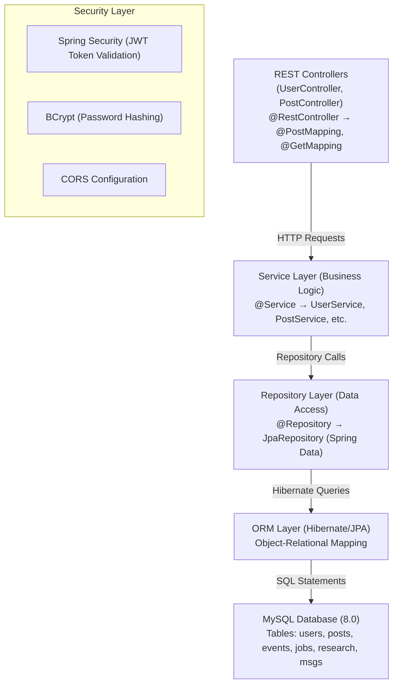
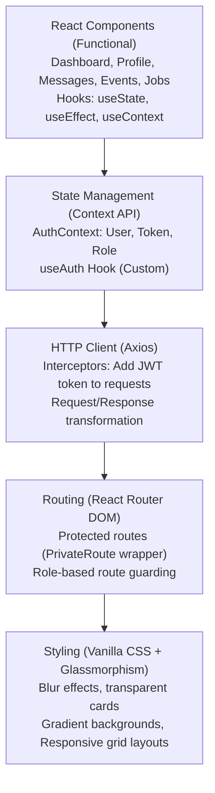
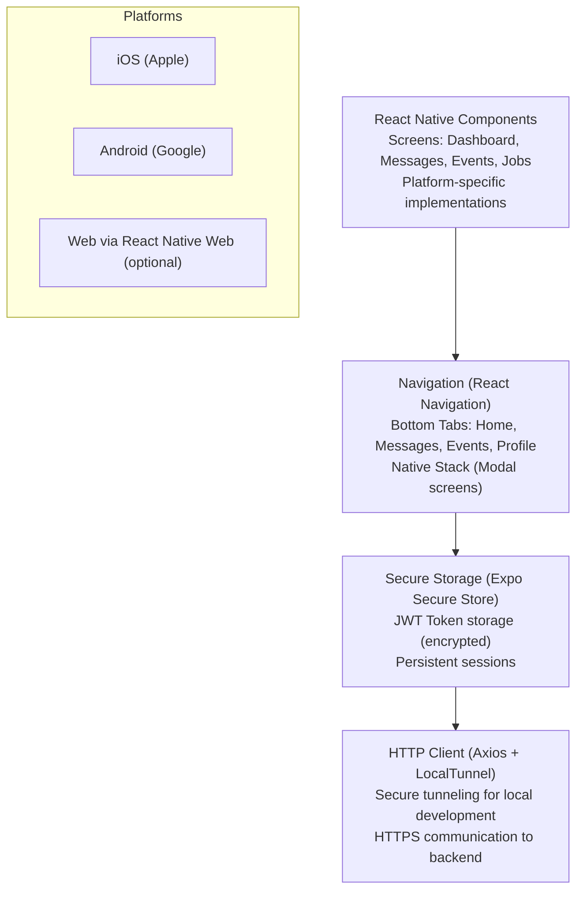
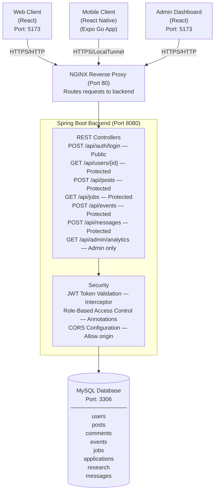

# 🎓 Digital Education & Collaboration Platform (DECP)

> A comprehensive full-stack Learning Management System (LMS) bridging Students, Alumni, and Administrators. Features web and React Native mobile applications with real-time social feeds, event management, job portals, research collaboration, and live messaging.


## 📋 Table of Contents

- [Overview](#overview)
- [Key Features](#-key-features--capabilities)
- [Technology Stack](#-technology-stack--architecture)
- [System Architecture](#-system-architecture-diagram)
- [Getting Started](#-getting-started--local-development)
- [API Documentation](#-rest-api-documentation)
- [Database Schema](#-database-schema)
- [Project Structure](#-project-directory-structure)
- [Deployment](#-deployment-guide)
- [Contributing](#-contributing)
- [License](#-license)

---

## Overview

**DECP** is an enterprise-grade Learning Management System designed to foster academic engagement and collaboration. The platform bridges the gap between:

- 👨‍🎓 **Students** - Access courses, jobs, events, research opportunities
- 🎓 **Alumni** - Mentor students, post opportunities, collaborate on research
- 🛡️ **Administrators** - Manage users, moderate content, monitor analytics

### Key Highlights

✅ **Multi-Platform** - Web (React + Vite) & Mobile (React Native + Expo)  
✅ **Real-Time** - Live messaging, social feeds, instant notifications  
✅ **Secure** - JWT authentication, BCrypt hashing, role-based access control  
✅ **Scalable** - Microservices-inspired architecture, horizontal scaling ready  
✅ **Production-Ready** - Docker containerization, comprehensive error handling  
✅ **Full-Stack** - Spring Boot backend, React frontend, MySQL database  

---

## ✨ Key Features & Capabilities

### 🛡️ Authentication & Role Management

- **Secure JWT Architecture** - Stateless token-based authentication
- **Spring Security Integration** - Built-in protection against common attacks
- **BCrypt Password Hashing** - Industry-standard password encryption
- **Role-Based Access Control (RBAC)**
  - `STUDENT` - Access courses, apply for jobs, register for events
  - `ALUMNI` - Post opportunities, mentor, collaborate on research
  - `ADMIN` - Full platform management, user promotion, analytics
- **Profile Management** - Users update credentials, Admins manage roles

### 📰 Social Feed & Dashboard Analytics

- **Interactive Timeline** - Post, like, comment, share academic insights
- **Full CRUD Operations** - Authors can edit/delete posts and comments
- **Admin Dashboard** - Real-time metrics (total users, active events, job postings)
- **Rich Text Formatting** - Enhanced post creation with styling options

### 💼 Career & Job Portal

- **Opportunity Discovery** - Search, filter, and apply for opportunities
- **Recruiter Controls** - Admins/Alumni post, edit, delete listings
- **Applicant Tracking System (ATS)** - View applicants in a dedicated modal
- **Application History** - Track submitted applications and statuses

### 📅 Event Management & Scheduling

- **Dynamic RSVP System** - Mark attendance as "Going" or "Decline"
- **Event Organization** - Create, update, delete, manage attendees
- **Live Attendee Roster** - Real-time view of who RSVP'd
- **Calendar Integration** - Upcoming events timeline

### 🔬 Research & Innovation Hub

- **Project Proposals** - Students/Alumni propose research initiatives
- **Team Building** - Request to join projects, manage team rosters
- **Project Lifecycle** - Status tracking (PLANNING → ACTIVE → COMPLETED)
- **Collaboration Tools** - File sharing, discussion boards, milestones

### 💬 Real-Time Direct Messaging

- **Global Directory** - Searchable university user directory
- **Live Chat Engine** - Chronological message history with timestamps
- **Smart Organization** - Auto-sort by recent activity, unread message counters
- **Message Notifications** - Real-time push notifications (mobile)

---

## 🛠️ Technology Stack & Architecture

### Backend Architecture



### Frontend Architecture



### Mobile Architecture



### Complete Technology Stack

| Layer | Technology | Version | Purpose |
|-------|-----------|---------|---------|
| **Backend Framework** | Spring Boot | 3.x | REST API framework |
| **Security** | Spring Security + JWT | Latest | Authentication & authorization |
| **Database** | MySQL | 8.0 | Relational data storage |
| **ORM** | Hibernate/JPA | 6.x | Object-relational mapping |
| **Build Tool** | Maven | 3.x | Dependency management |
| **Web Frontend** | React | 18+ | Web UI components |
| **Build Tool (Web)** | Vite | 4.x+ | Fast dev server & build |
| **Styling (Web)** | Vanilla CSS | - | Glassmorphism design |
| **Routing (Web)** | React Router DOM | 6.x | SPA routing |
| **HTTP Client** | Axios | Latest | Promise-based HTTP client |
| **Mobile Framework** | React Native | Latest | Cross-platform mobile |
| **Mobile Launcher** | Expo | Latest | Development & distribution |
| **Mobile Navigation** | React Navigation | Latest | Native navigation |
| **Mobile Storage** | Expo Secure Store | Latest | Encrypted token storage |
| **Containerization** | Docker | 20.10+ | Container runtime |
| **Orchestration** | Docker Compose | 2.x+ | Multi-container management |
| **Web Server** | Nginx | Latest | Reverse proxy & static serve |

---

## 🏗️ System Architecture Diagram

### Complete Application Flow



---

## 🚀 Getting Started & Local Development

### Prerequisites

Before you begin, ensure you have:

- **Docker** & **Docker Compose** - [Install](https://www.docker.com/products/docker-desktop)
- **Node.js** (v18+) - [Install](https://nodejs.org/)
- **Java 17+** - [Install](https://adoptium.net/)
- **Git** - [Install](https://git-scm.com/)
- **Expo Go App** - Download from App Store or Google Play (for mobile testing)

### Option 1: Docker Compose (Recommended)

#### Step 1: Clone Repository

```bash
git clone https://github.com/chala2001/LMS_University.git
cd LMS_University
```

#### Step 2: Start Services

```bash
# Start all containers (MySQL, Backend, Frontend)
docker-compose up --build -d

# View logs
docker-compose logs -f

# Check service status
docker-compose ps
```

#### Step 3: Access Applications

| Application | URL | Details |
|-------------|-----|---------|
| **Web Frontend** | http://localhost:5173 | React web app |
| **Backend API** | http://localhost:8080 | Spring Boot REST API |
| **Admin Dashboard** | http://localhost:5173/admin | Admin login |
| **MySQL Database** | localhost:3307 | Credentials: root/root |

#### Step 4: Test with Sample User

```bash
# Option A: Register new account
# Click "Sign Up" on login page
# Fill form: Email, Name, Password
# Account created as STUDENT role

# Option B: Use admin account (inject via MySQL)
docker exec -i decp-mysql mysql -uroot -proot LMS_db -e \
  "INSERT INTO users (email, name, password, role) VALUES \
  ('admin@university.edu', 'System Admin', '\$2a\$10\$...bcrypt_hash...', 'ADMIN');"

# Login with:
# Email: admin@university.edu
# Password: 123456
```

### Option 2: Manual Setup (Development)

#### Backend Setup

```bash
# Navigate to backend
cd backend

# Build with Maven
mvn clean install

# Run Spring Boot app
mvn spring-boot:run

# Backend runs on: http://localhost:8080
```

#### Frontend Setup

```bash
# Navigate to frontend
cd frontend

# Install dependencies
npm install

# Start development server
npm run dev

# Frontend runs on: http://localhost:5173
```

#### Mobile Setup

```bash
# Navigate to mobile
cd mobile

# Install dependencies
npm install

# Expose backend via LocalTunnel
npx localtunnel --port 8080

# Copy generated URL (e.g., https://xyz.loca.lt)

# Update API URL in src/api/index.js
# const API_URL = 'https://xyz.loca.lt'

# Start Expo
npx expo start --tunnel

# Scan QR code with Expo Go app
```

---

## 🔌 REST API Documentation

### Authentication

#### Login
```http
POST /api/auth/login
Content-Type: application/json

{
  "email": "student@university.edu",
  "password": "password123"
}

Response (200 OK):
{
  "token": "eyJhbGciOiJIUzI1NiIsInR5cCI6IkpXVCJ9...",
  "user": {
    "id": 1,
    "email": "student@university.edu",
    "name": "John Doe",
    "role": "STUDENT"
  }
}
```

#### Register
```http
POST /api/auth/register
Content-Type: application/json

{
  "email": "newuser@university.edu",
  "name": "Jane Smith",
  "password": "securepass123"
}

Response (201 Created):
{
  "id": 2,
  "email": "newuser@university.edu",
  "name": "Jane Smith",
  "role": "STUDENT"
}
```

### Core Endpoints

#### Posts (Social Feed)

```http
# Get all posts
GET /api/posts
Authorization: Bearer <token>

Response (200):
[
  {
    "id": 1,
    "content": "Great seminar today!",
    "author": {
      "id": 1,
      "name": "John Doe"
    },
    "createdAt": "2026-05-03T10:30:00Z",
    "likes": 5,
    "comments": 2
  }
]

# Create post
POST /api/posts
Authorization: Bearer <token>
Content-Type: application/json

{
  "content": "Excited for the hackathon!"
}

# Like post
POST /api/posts/{postId}/like
Authorization: Bearer <token>

# Comment on post
POST /api/posts/{postId}/comments
Authorization: Bearer <token>
Content-Type: application/json

{
  "content": "Great initiative!"
}
```

#### Events

```http
# Get all events
GET /api/events
Authorization: Bearer <token>

# Create event (ADMIN/ALUMNI only)
POST /api/events
Authorization: Bearer <token>
Content-Type: application/json

{
  "title": "Coding Workshop",
  "description": "Learn React",
  "startDate": "2026-05-15T10:00:00Z",
  "endDate": "2026-05-15T12:00:00Z",
  "location": "Building A"
}

# RSVP to event
POST /api/events/{eventId}/rsvp
Authorization: Bearer <token>
Content-Type: application/json

{
  "status": "GOING"  // or "DECLINED"
}
```

#### Jobs

```http
# Get job listings
GET /api/jobs
Authorization: Bearer <token>

# Post job (ADMIN/ALUMNI only)
POST /api/jobs
Authorization: Bearer <token>
Content-Type: application/json

{
  "title": "Software Engineer",
  "company": "Tech Company",
  "description": "Full-stack development role",
  "salary": "$100,000 - $150,000"
}

# Apply for job
POST /api/jobs/{jobId}/apply
Authorization: Bearer <token>

# Get applicants (for recruiters)
GET /api/jobs/{jobId}/applicants
Authorization: Bearer <token>
```

#### Messages

```http
# Get all conversations
GET /api/messages/conversations
Authorization: Bearer <token>

# Get messages with user
GET /api/messages/{userId}
Authorization: Bearer <token>

# Send message
POST /api/messages
Authorization: Bearer <token>
Content-Type: application/json

{
  "recipientId": 2,
  "content": "Hi! How are you?"
}
```

---

## 🗄️ Database Schema

### Core Tables

```sql
-- Users Table
CREATE TABLE users (
  id BIGINT PRIMARY KEY AUTO_INCREMENT,
  email VARCHAR(255) UNIQUE NOT NULL,
  name VARCHAR(255) NOT NULL,
  password VARCHAR(255) NOT NULL (BCrypt Hash),
  role ENUM('STUDENT', 'ALUMNI', 'ADMIN') DEFAULT 'STUDENT',
  created_at TIMESTAMP DEFAULT CURRENT_TIMESTAMP,
  updated_at TIMESTAMP DEFAULT CURRENT_TIMESTAMP ON UPDATE CURRENT_TIMESTAMP
);

-- Posts Table
CREATE TABLE posts (
  id BIGINT PRIMARY KEY AUTO_INCREMENT,
  content LONGTEXT NOT NULL,
  author_id BIGINT NOT NULL,
  created_at TIMESTAMP DEFAULT CURRENT_TIMESTAMP,
  updated_at TIMESTAMP DEFAULT CURRENT_TIMESTAMP ON UPDATE CURRENT_TIMESTAMP,
  FOREIGN KEY (author_id) REFERENCES users(id) ON DELETE CASCADE
);

-- Events Table
CREATE TABLE events (
  id BIGINT PRIMARY KEY AUTO_INCREMENT,
  title VARCHAR(255) NOT NULL,
  description LONGTEXT,
  start_date DATETIME NOT NULL,
  end_date DATETIME NOT NULL,
  location VARCHAR(255),
  created_by BIGINT NOT NULL,
  created_at TIMESTAMP DEFAULT CURRENT_TIMESTAMP,
  FOREIGN KEY (created_by) REFERENCES users(id)
);

-- Jobs Table
CREATE TABLE jobs (
  id BIGINT PRIMARY KEY AUTO_INCREMENT,
  title VARCHAR(255) NOT NULL,
  company VARCHAR(255) NOT NULL,
  description LONGTEXT,
  salary VARCHAR(255),
  posted_by BIGINT NOT NULL,
  created_at TIMESTAMP DEFAULT CURRENT_TIMESTAMP,
  FOREIGN KEY (posted_by) REFERENCES users(id)
);

-- Messages Table
CREATE TABLE messages (
  id BIGINT PRIMARY KEY AUTO_INCREMENT,
  sender_id BIGINT NOT NULL,
  recipient_id BIGINT NOT NULL,
  content LONGTEXT NOT NULL,
  is_read BOOLEAN DEFAULT FALSE,
  created_at TIMESTAMP DEFAULT CURRENT_TIMESTAMP,
  FOREIGN KEY (sender_id) REFERENCES users(id),
  FOREIGN KEY (recipient_id) REFERENCES users(id)
);
```

---

## 📂 Project Directory Structure

```
LMS_University/
│
├── backend/                          # Spring Boot API (Java 17, Maven)
│   ├── src/main/java/com/decp/decp_platform/
│   │   ├── DecpPlatformApplication.java   # Application entry point
│   │   ├── config/                        # SecurityConfig, JwtUtil,
│   │   │                                  # JwtAuthenticationFilter, CorsConfig
│   │   ├── user/                          # Auth, profiles, roles (RBAC)
│   │   ├── post/                          # Social feed posts
│   │   ├── comment/                       # Post comments
│   │   ├── like/                          # Post likes
│   │   ├── messaging/                     # Direct messaging
│   │   ├── notification/                  # Notifications
│   │   ├── event/                         # Event management
│   │   ├── job/                           # Job portal & applications
│   │   ├── research/                      # Research collaboration
│   │   └── analytics/                     # Admin analytics
│   │
│   │   Each feature package follows the same layering:
│   │   controller/ · service/ · repository/ · entity/ · dto/
│   │
│   ├── src/main/resources/application.properties
│   ├── src/test/                          # Unit tests
│   ├── Dockerfile                         # Multi-stage: Maven build -> JRE runtime
│   ├── pom.xml                            # Maven dependencies
│   └── mvnw, mvnw.cmd, .mvn/              # Maven wrapper
│
├── frontend/                         # React 18 + Vite web client
│   ├── src/
│   │   ├── pages/                         # Auth, Dashboard, Events, Jobs,
│   │   │                                  # Messages, Profile, Research
│   │   ├── components/Layout.jsx          # Shared app shell
│   │   ├── context/AuthContext.jsx        # Auth state management
│   │   ├── api/index.js                   # Axios instance with interceptors
│   │   ├── App.jsx                        # Root component & routing
│   │   ├── main.jsx                       # Entry point
│   │   └── index.css                      # Global styles
│   ├── public/
│   ├── Dockerfile                         # Multi-stage: Node build -> Nginx
│   ├── nginx.conf                         # Nginx reverse-proxy config
│   ├── vite.config.js
│   └── package.json
│
├── mobile/                           # React Native (Expo) client
│   ├── src/
│   │   ├── screens/                       # Login, Register, Dashboard, Events,
│   │   │                                  # Jobs, Messages, Profile, Research
│   │   ├── context/AuthContext.js         # Auth + SecureStore
│   │   └── api/index.js                   # Axios + tunnel base URL
│   ├── assets/                            # Icons and splash screens
│   ├── App.js                             # Root component
│   ├── index.js                           # Expo entry point
│   ├── app.json                           # Expo config
│   └── package.json
│
├── docs/                             # Documentation
│   ├── backend.md                         # Backend architecture & API notes
│   ├── frontend.md                        # Frontend architecture
│   ├── docker.md                          # Containerization walkthrough
│   └── security.md                        # Web security implementation
│
├── scripts/                          # PowerShell API smoke tests
│   ├── test_backend.ps1
│   ├── test_admin_backend.ps1
│   ├── test_delete.ps1
│   └── test_msg.ps1
│
├── docker-compose.yml                # Multi-container orchestration
├── .gitignore
└── README.md                         # This file
```

> 🚀 Deploying this stack on Kubernetes? The
> [LMS_FullStack_K8s_Deployment](https://github.com/chala2001/LMS_FullStack_K8s_Deployment)
> repo carries the same layout plus a `k8s/` directory of manifests
> (StatefulSet, Deployments, Services, ConfigMaps, Secrets, PV/PVC).

---

## 🌐 Deployment

### Docker Deployment

All services are containerized and deployment-ready:

```bash
# Build images
docker-compose build

# Start all services
docker-compose up -d

# View logs
docker-compose logs -f backend

# Scale backend
docker-compose up -d --scale backend=5
```

### Cloud Deployment

See [DEPLOYMENT_GUIDE.md](DEPLOYMENT_GUIDE.md) for:
- **AWS** - ECS, RDS, CloudFront
- **Google Cloud** - Cloud Run, Cloud SQL
- **Azure** - App Service, Azure Database
- **DigitalOcean** - App Platform, Managed Databases
- **Heroku** - Container deployment

---

## 🤝 Contributing

Contributions are welcome! Please:

1. Fork the repository
2. Create a feature branch (`git checkout -b feature/AmazingFeature`)
3. Follow code style (Java: Google Style, React: Airbnb ESLint)
4. Commit with conventional commits (`feat:`, `fix:`, `docs:`)
5. Push to your branch (`git push origin feature/AmazingFeature`)
6. Open a Pull Request

---

## 📝 License

Distributed under the **MIT License**. See [LICENSE](LICENSE) for details.

---

## 👨‍💻 Author

**Chalaka Samith** - Full-Stack & Mobile Developer  
GitHub: [@chala2001](https://github.com/chala2001)

---

<div align="center">

**Built with ❤️ for the academic community**

[⬆ back to top](#-digital-education--collaboration-platform-decp)

</div>
